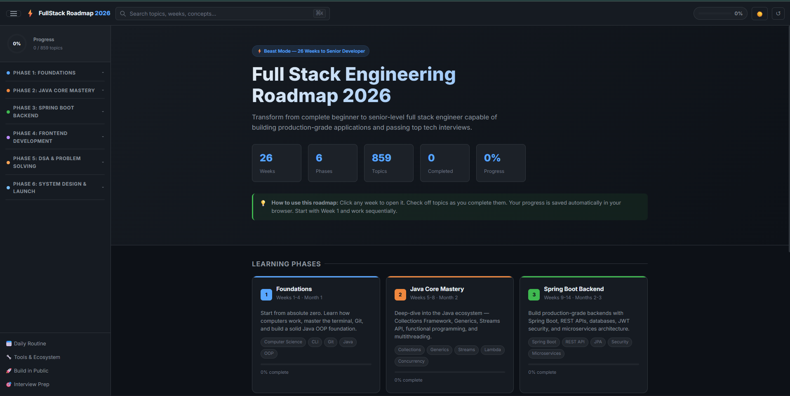

# ⚡ Full Stack Engineer Roadmap 2026

A comprehensive, interactive 26-week curriculum to go from **complete beginner** to **senior-level full stack engineer** — covering Java backend, modern frontend, DSA, and system design.


## What's Inside

| Phase | Weeks | Topics |
|-------|-------|--------|
| 1 — Foundations | 1–4 | CS basics, CLI, Git, Java OOP |
| 2 — Java Core Mastery | 5–8 | Collections, Streams, Concurrency |
| 3 — Spring Boot Backend | 9–14 | REST APIs, JPA, Security, Microservices |
| 4 — Frontend Development | 15–20 | HTML/CSS, JavaScript, React, TypeScript, Next.js |
| 5 — DSA & Problem Solving | 21–24 | Arrays, Trees, Graphs, DP, Backtracking |
| 6 — System Design & Launch | 25–26 | Scalability, Architecture, Portfolio, Career |

## Features

- **Interactive progress tracking** — check off topics as you learn them (saved in browser)
- **Daily schedules** — 7 days per week with specific topics and focus areas
- **Deep concept explanations** — with key points and runnable code examples
- **80+ DSA problems** — organized by pattern with difficulty tags
- **System design case studies** — Twitter, YouTube, WhatsApp walkthroughs
- **Project ideas** — beginner to advanced, with features and tech stack
- **Curated resources** — books, docs, courses, and articles for every week
- **Search** — Ctrl+K / ⌘K to instantly find any topic across all 26 weeks
- **Dark / Light mode** — toggle with one click
- **Fully offline** — no server, no dependencies, just open `index.html`

## Getting Started

1. Clone the repo:
   ```bash
   git clone https://github.com/cetill27/Roadmap.git
   ```
2. Open `index.html` in your browser — that's it.

No build tools, no npm install, no server required. Works completely offline.

## Tech Stack

This roadmap is a self-contained static website built with:

- **HTML5** — semantic structure
- **CSS3** — custom properties, Flexbox, Grid, dark/light themes
- **Vanilla JavaScript** — zero dependencies, ~230 KB total

## Screenshot



## License

MIT — use it, fork it, share it.
